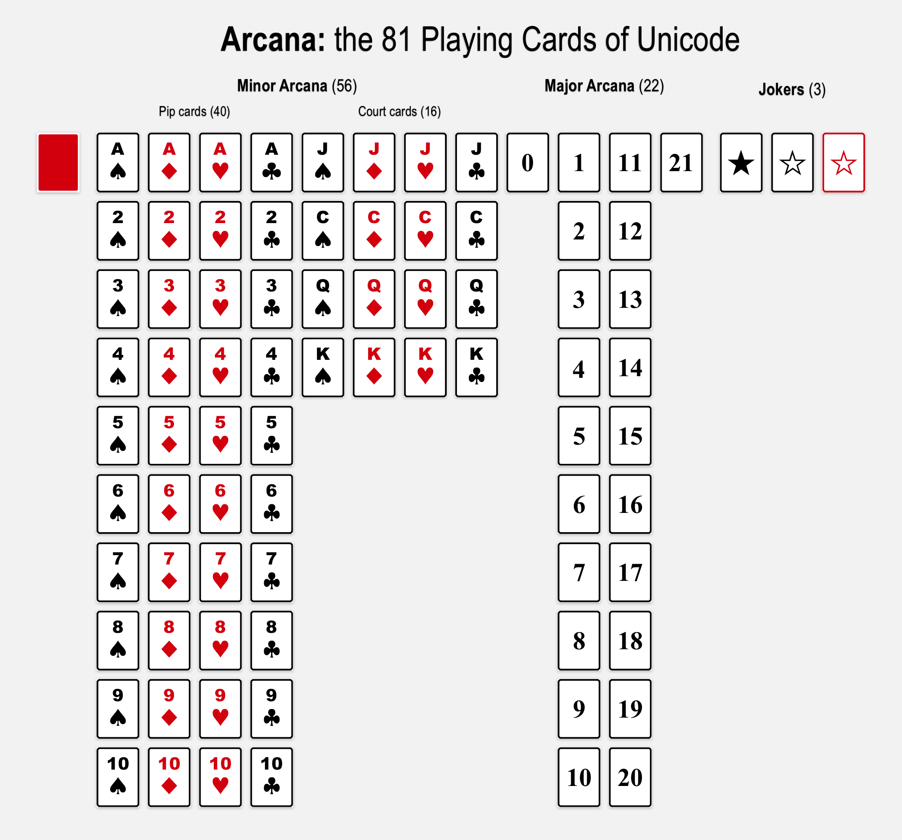

# Arcana

**Arcana** models, generates, and manipulates playing card sets, decks, and packs.

Inspired by the Playing Cards range (1F0A0–1F0FF) of Unicode.

Based on experiments developed in [CodePen](https://codepen.io/ogab/pen/peXpqW) and [repl.it](https://repl.it/HBzu/110).

## Project goal

* **It should use all extant traditional game and divination suit names**…
  * French/Anglo-American: Spades ♠️, Hearts ♥️, Diamonds ♦️, Clubs ♣️
  * Latin/Spanish/Italian:  Swords ⚔️, Cups 🍵, Coins (Pentacles) 💰, Wands (Batons) 🏏
  * German: Leaves, Hearts, Bells, Acorns
  * Swiss: Shields, Roses, Bells, Acorns
* …in **multiple languages**…
  * English
  * French
  * Spanish
  * Italian
  * German
* …**colors**…
  * 2-color: black and red
  * 4-color: black, red, blue, green
* …using **one or more instance of 81 possible cards**…
  * 40 pip
  * 16 court
  * 3 jokers
  * 22 trumps
* …within a **complete, stripped, or multi-pack deck**…
* …with a **customizable card back**…
* …and **be accessible for users with visual disabilities**.
* **It should utilize all 82 Unicode card glyphs**.
  * Since the 22 trump glyphs don't yet exist in any default macOS font, **it should include a card glyph webfont**: a subset of [Symbola](http://users.teilar.gr/~g1951d/Symbola.zip) from [George Douros](http://users.teilar.gr/~g1951d/) generated using [Font Squirrel's  Webfont Generator](https://www.fontsquirrel.com/tools/webfont-generator).

## Possible applications

* gameplay
* game design
* divination
* cardistry and magic utilities
* history of playing cards and games
* probability/statistical analysis

## About the code

### Current version

#### 0.4.0

* Integrated [Web Speech API](https://github.com/mdn/web-speech-api): the name of a clicked card is spoken.
* Converted trump card numbering from Roman to Arabic.
* Added CSS class for card **rank**.

### Previous versions

#### 0.3.0

Adding "Show All Card Backs/Faces" buttons and ability to click on cards to show their faces.

[*arcana-0.3.0.js*](scripts/arcana-0.3.0.js):

* `App` object
  * `DATA` array
    * `GLYPHS` array
    * `RANKS` array
    * `SUITS` array
    * `TRUMP` array
  * `bindEvents()` method
  * `generateDeck()` method
  * `renderDeck(deck)` method
  * `init` method

#### 0.2.0

[*arcana-0.2.0.js*](scripts/arcana-0.2.0.js):

* `App` object:
  * `DATA` object:
    * `GLYPHS` array
    * `RANKS` object
    * `SUITS` object
    * `TRUMP` object
  * `generateDeck()` method
  * `renderDeck(deck)` method
  * `init` method

#### 0.1.0

[*arcana-0.1.0.js*](scripts/arcana-0.1.0.js):

* `App` object:
  * `data` object:
    * `glyphs` array holds strings of each cards as a Unicode glyph
    * `pips` array holds Unicode suit symbols
    * `ranks` array holds rank name/value (Ace, 2, 3 etc. thru King)
    * `suits` array holding strings of suit names
    * `arcanaRanks`, `arcanaSuits`, and `arcanaTrumps` arrays for generating Tarot decks
  * `makeCardNames(ranks, suits)` method
  * `renderCards()` method
  * `init()` method

## References

* <https://en.wikipedia.org/wiki/Minor_Arcana>
* <https://en.wikipedia.org/wiki/Tarot_Nouveau>
* <https://en.wikipedia.org/wiki/Rider-Waite_tarot_deck>
* <https://en.wikipedia.org/wiki/Playing_cards_in_Unicode>
* <http://www.unicode.org/charts/PDF/U1F0A0.pdf>
* <http://www.cardmagic.info/know_more.htm>

## Additional References & Inspiration

* <http://www.egreenway.com/tarot/>
* <http://www.tarotpedia.com/>
* <http://www.ovdiyenko.com/>
* <https://en.wikipedia.org/wiki/Template:Cards>
* <http://oll.libertyfund.org/pages/new-playing-cards-for-the-french-republic-1793-94>
* <https://digitalcollections.nypl.org/collections/playing-cards-engineering#/?tab=about>
* <https://archive.org/details/aen4317.0001.001.umich.edu>
* <https://archive.org/details/cu31924029917576>
